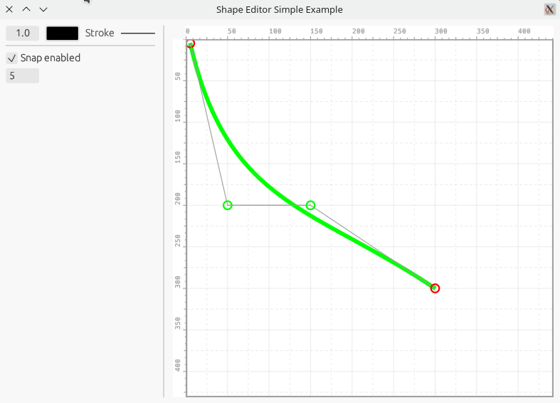

# Egui Shape Editor

Simple shape editor that can be used as widget in [Egui](https://github.com/emilk/egui) framework.

## Description

I didn't find any widgets that can be used to edit shape, so created my own.

## Getting Started

Examples are in the [examples](examples) folder.



### Demo

Online [demo](https://antroids.github.io/egui-shape-editor/examples/simple/dist/).

### Installing

* Add the library to dependencies.
* Show on the Ui as any other widget

### Executing program

```
cargo run -p simple
```

## Project state
The project is in Proof Of Concept stage. Any public API can be changed in following releases.

### TODO
- [ ] Fix Circles and Rectangles transform

- [ ] Delete action
- [ ] Modify shape action
  - [ ] Modify stroke
  - [ ] Fill
- [ ] Add point to path action
- [ ] Selection edit
  - [ ] Resize
  - [ ] Rotate
  - [ ] Mirror
- [ ] Minimap?
- [ ] Show/hide control points

### Contributing
Any contributions are welcome.

## License

All code in this repository is dual-licensed under either:
* MIT License (LICENSE-MIT or http://opensource.org/licenses/MIT) 
* Apache License, Version 2.0 (LICENSE-APACHE or http://www.apache.org/licenses/LICENSE-2.0)
